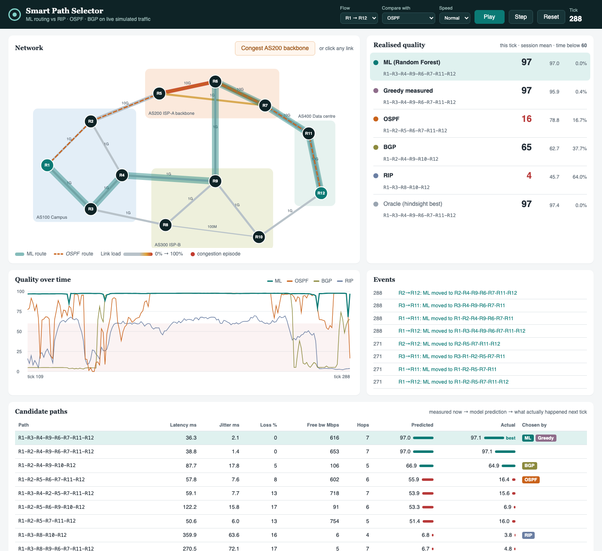

# Smart Path Selector

Intelligent router path selection using machine learning.

RIP, OSPF and BGP choose paths from static metrics (hop count, configured cost,
policy). They cannot see congestion, packet loss or jitter. This project trains a
Random Forest on measured path metrics to predict each candidate path's quality in
the next interval, and routes on that prediction.



## Results

Four flows routed through 2,000 ticks of traffic none of the models saw during
training:

| Strategy | Mean quality (0-100) | Mean latency | Mean loss | Time degraded | Route changes / 1,000 |
|---|---|---|---|---|---|
| **ML (Random Forest)** | **97.0** | **37.5 ms** | **0.37%** | **0.3%** | 30 |
| Greedy on measurements (no ML) | 96.7 | 37.5 ms | 0.43% | 0.4% | 243 |
| OSPF | 78.3 | 88.1 ms | 4.29% | 19.0% | 0 |
| BGP | 76.7 | 98.0 ms | 3.30% | 23.3% | 0 |
| RIP | 64.7 | 90.5 ms | 2.60% | 40.5% | 0 |
| Oracle (hindsight best) | 97.3 | 35.2 ms | 0.31% | 0.1% | 119 |

Model accuracy on unseen traffic: **R² 0.897, MAE 4.7** (linear regression: R²
0.786). Hop count, the metric RIP routes on, has near-zero feature importance.

The full write-up, including limitations, is in
[docs/Final_Report.md](docs/Final_Report.md).

## Setup

```bash
python -m venv .venv && source .venv/bin/activate
pip install -r requirements.txt
```

## Usage

```bash
python -m smartpath generate     # simulate traffic → data/train.csv, data/test.csv, baseline tables
python -m smartpath train        # train the Random Forest → models/, reports/model_metrics.json
python -m smartpath evaluate     # routing comparison + congestion drill → reports/
python -m smartpath dashboard    # live dashboard on http://127.0.0.1:8050
python -m smartpath validate validation/packet_tracer/sample_scenario   # score Packet Tracer measurements
pytest                           # 31 tests
```

`generate` and `train` take about a minute each, `evaluate` about two. The model
file is not committed; `train` recreates it.

### Dashboard

- **Play / Step**: advance the simulation. Every strategy routes the same traffic.
- **Flow** and **Compare with**: choose which flow and which protocol to overlay
  against the ML route.
- **Congest AS200 backbone**, or click any link: inject a congestion episode and
  watch the ML route move while static protocols stay put.
- **Candidate paths**: measured metrics, the model's predicted score and the quality
  the path actually delivered next tick.

## How it works

1. **Topology** (`smartpath/topology.py`): 12 routers in 4 ASes. The AS200 backbone
   is fast but shared, AS300 is slower with a 100 Mbps shortcut. RIP, OSPF and BGP
   each pick a different route.
2. **Traffic** (`traffic.py`): per-link utilisation with a mean-reverting
   process, a daily cycle and random congestion episodes.
3. **Metrics** (`metrics.py`): queueing delay, jitter, loss and spare bandwidth
   from utilisation; noisy probe measurements; quality score = E-model R-factor ×
   bandwidth sufficiency.
4. **Model** (`model.py`): Random Forest predicting next-tick quality from
   latency, jitter, loss, available bandwidth, hop count, bottleneck capacity and
   trends.
5. **Engine** (`engine.py`): scores all candidate paths and switches only on a
   clear win, to avoid flapping.
6. **Evaluation** (`live.py`, `evaluate.py`): all strategies run in one loop on
   identical traffic; the dashboard uses the same loop.

## Project documents

| Review | Documents |
|---|---|
| DA 1: overview | [Deck](docs/DA1_Project_Overview.pptx) · [Proposal](docs/proposal.md) |
| DA 2: 50% progress | [Deck](docs/DA2_Progress_Review.pptx) · [Report (md)](docs/DA2_Progress_Report.md) · [docx](docs/DA2_Progress_Report.docx) · [pdf](docs/DA2_Progress_Report.pdf) |
| Final review | [Deck](docs/Final_Review.pptx) · [Report (md)](docs/Final_Report.md) · [docx](docs/Final_Report.docx) · [pdf](docs/Final_Report.pdf) · [Demo script](docs/demo_script.md) |
| Validation | [Packet Tracer guide](docs/packet_tracer_guide.md) |

Git tags `da1`, `da2` and `final` mark each review.

## Layout

| Path | Contents |
|---|---|
| `smartpath/` | Simulator, protocols, model, engine, evaluation, Packet Tracer parser, CLI |
| `dashboard/` | Flask app, HTML/CSS/JS (no external dependencies) |
| `tests/` | Unit and integration tests |
| `reports/` | Metrics (JSON/CSV) and figures |
| `validation/packet_tracer/` | Measurement layout with a sample scenario |
| `docs/` | Proposal, review decks, reports, guides |
| `docs/decks/` | Deck generators (`node da1.js` etc., needs `npm install pptxgenjs`) |
| `tools/` | Markdown → docx converter for the reports |
