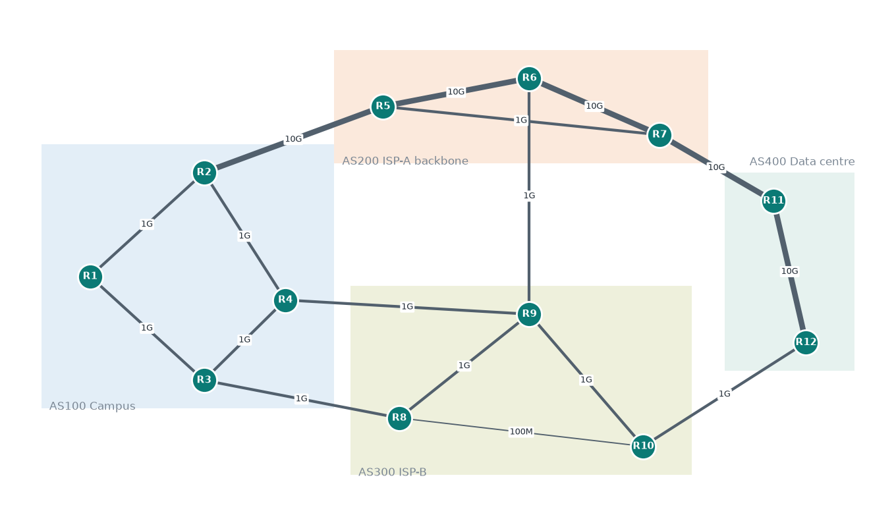
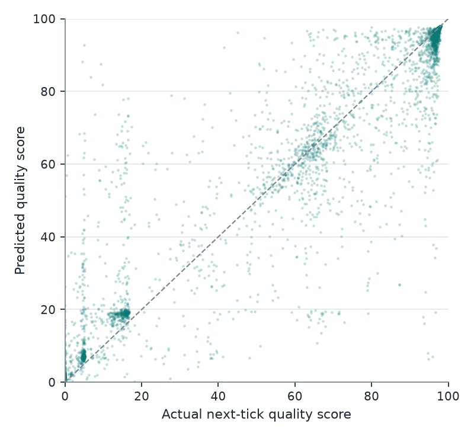
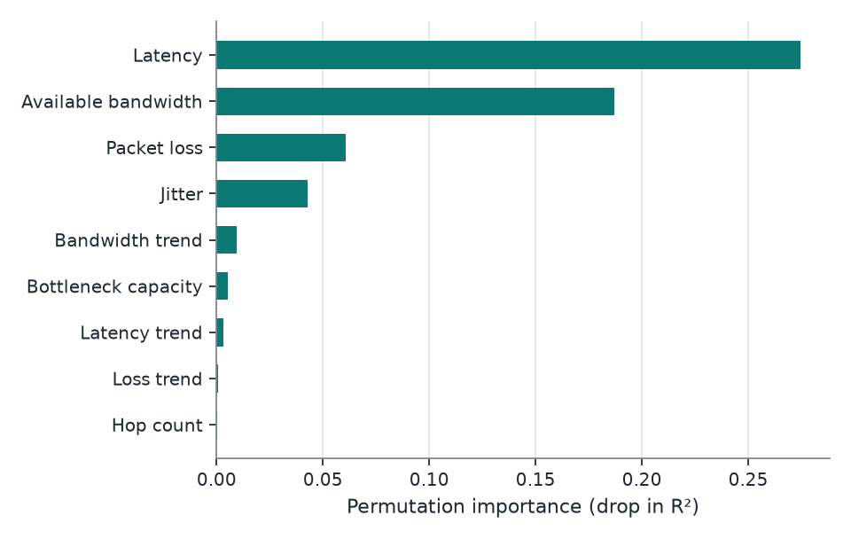
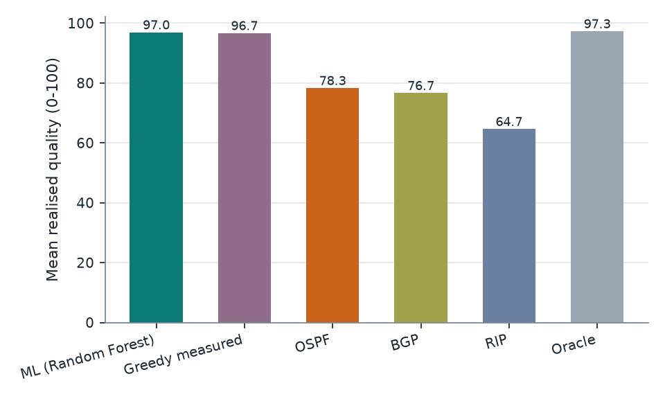
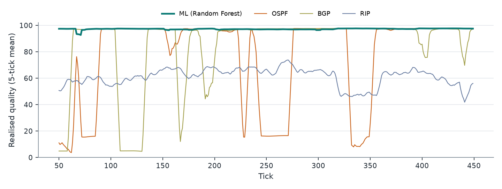

# Intelligent Router Path Selection using Machine Learning: Final Report

**Repository:** https://github.com/K-RANGARAJAN/smart-path-selector (tag `final`)

## 1. Abstract

RIP, OSPF and BGP pick routes from static information: hop count, configured
cost and business policy. None of them react to congestion. This project builds a
multi-AS network simulator with time-varying traffic, trains a Random Forest to
predict each candidate path's quality in the next interval from noisy measurements,
and routes on that prediction.

On traffic it never saw during training, the ML router delivers a mean path quality
of **97.0/100**, against **78.3 for OSPF, 76.7 for BGP and 64.7 for RIP**. The
hindsight-best path would score 97.3, so ML closes **98%** of the gap between OSPF
and that best path. Compared with OSPF, mean latency is 57% lower and packet loss 91%
lower. A live dashboard shows every strategy routing the same traffic in real time
and lets you inject congestion on any link.

## 2. Problem

| Protocol | Decides on | Blind to |
|---|---|---|
| RIP | Hop count | Speed, load, delay, loss |
| OSPF | Σ reference bandwidth ÷ link bandwidth (Dijkstra) | Congestion; costs are fixed |
| BGP | Local preference, AS-path length | Path performance |

A path that is best on paper can be heavily congested right now, and these
protocols have no way to notice.

## 3. System design



| Stage | Module | Summary |
|---|---|---|
| Topology | `topology.py` | 12 routers, 4 ASes, 17 links (100 Mbps-10 Gbps); flows R1→R12, R1→R11, R3→R11, R2→R12 |
| Traffic | `traffic.py` | Per-link utilisation: AR(1) around base load + daily cycle + random congestion episodes (10-60 ticks, +25-60% load); episodes can be injected manually |
| Metrics | `metrics.py` | Queueing delay ∝ u/(1−u), jitter ∝ queue delay, loss spikes near saturation, spare bandwidth; path aggregation; noisy probes (loss from 100 pings) |
| Quality score | `metrics.py` | Simplified ITU-T G.107 E-model R-factor × √(bandwidth sufficiency for a 150 Mbps flow), scaled 0-100 |
| Baselines | `protocols.py` | RIP (min hops), OSPF (min cost, checked against Dijkstra), BGP (local-pref → AS-path → IGP cost) |
| Dataset | `dataset.py` | Features measured at tick *t*, target = true quality at *t*+1 |
| Model | `model.py` | Random Forest regressor (150 trees, depth 16, leaf 20) |
| Engine | `engine.py` | Scores all candidates; switches only when a path wins by ≥ 3 points (anti-flapping) |
| Session | `live.py` | One loop in which all strategies route the same flows; shared by evaluation and dashboard |
| Evaluation | `evaluate.py` | Closed-loop comparison and congestion drill |
| Dashboard | `dashboard/` | Flask + vanilla JS/SVG, runs offline |
| Validation | `packet_tracer.py` | Parses Packet Tracer / IOS ping, traceroute and `show interfaces` output and scores paths |

Each protocol picks a different route for R1→R12. RIP takes the 4-hop route over a
100 Mbps link. OSPF takes the 10 Gbps AS200 backbone, which is shared and
congestion-prone. BGP takes AS300, the cheaper contract.

## 4. Model

### 4.1 Data

| | Train | Test |
|---|---|---|
| Traffic seed | 1 | 2 |
| Ticks | 6,000 | 2,000 |
| Rows | 210,000 | 70,000 |

Features: latency, jitter, loss, available bandwidth, hop count, bottleneck
capacity, and the change in latency, loss and bandwidth since the previous
measurement.

### 4.2 Accuracy on unseen traffic

| Predictor | R² | MAE | RMSE |
|---|---|---|---|
| **Random Forest** | **0.897** | **4.69** | **10.77** |
| Scoring formula on current measurements (no ML) | 0.876 | 5.56 | 11.82 |
| Linear regression | 0.786 | 10.30 | 15.53 |

5-fold time-blocked cross-validation: R² 0.912 ± 0.009.



The largest errors happen when a path's state changes sharply between the
measurement and the next tick (error vs. size of change: r = 0.92).

### 4.3 Feature importance

Latency (0.275) and available bandwidth (0.187) dominate, followed by loss (0.061)
and jitter (0.043). **Hop count, RIP's only metric, scores 0.0001.**



## 5. Routing results

All strategies routed the same 4 flows through 2,000 ticks of new traffic
(seed 3). Quality is what the chosen path actually delivered in the next tick.

| Strategy | Mean quality | Mean latency (ms) | p95 latency (ms) | Mean loss (%) | Time below 60 (%) | Near-optimal picks (%) | Route changes / 1,000 |
|---|---|---|---|---|---|---|---|
| **ML (Random Forest)** | **97.0** | **37.5** | **50.9** | **0.37** | **0.3** | **97.6** | 29.8 |
| Greedy measured (no ML) | 96.7 | 37.5 | 53.9 | 0.43 | 0.4 | 94.9 | 243.4 |
| OSPF | 78.3 | 88.1 | 291.3 | 4.29 | 19.0 | 61.1 | 0 |
| BGP | 76.7 | 98.0 | 296.5 | 3.30 | 23.3 | 65.0 | 0 |
| RIP | 64.7 | 90.5 | 293.8 | 2.60 | 40.5 | 36.4 | 0 |
| Oracle (hindsight best) | 97.3 | 35.2 | 47.6 | 0.31 | 0.1 | 100 | 118.5 |

A pick counts as near-optimal when its realised quality is within 1 point of the best candidate that tick.



Per flow, mean quality:

| Flow | ML | Greedy | OSPF | BGP | RIP | Oracle |
|---|---|---|---|---|---|---|
| R1→R11 | 97.0 | 96.7 | 78.9 | 75.9 | 86.4 | 97.4 |
| R1→R12 | 96.7 | 96.5 | 77.8 | 76.9 | 47.6 | 97.1 |
| R2→R12 | 97.1 | 96.8 | 78.1 | 77.2 | 77.2 | 97.4 |
| R3→R11 | 97.0 | 96.8 | 78.5 | 76.7 | 47.4 | 97.3 |



### 5.1 Congestion drill

A congestion episode (+60% load for 40 ticks) was injected on backbone link R5-R6
in 20 independent runs, measuring flow R1→R12:

| Strategy | Mean quality during event | Time below 60 during event |
|---|---|---|
| ML | 95.9 | 1.4% |
| Greedy measured | 95.7 | 1.5% |
| OSPF | 28.7 | 79.9% |
| BGP | 55.8 | 46.5% |
| RIP | 43.8 | 81.5% |
| Oracle | 96.6 | 0.6% |

In 17 of the 20 runs the ML router was already on another path when the event
started. In the 3 runs where it was on R5-R6, it left after 3.3 ticks on average
(at most 4). That matches the ramp-up time of the episode.

### 5.2 Speed

Scoring 9 candidate paths takes 4.4 ms. A full tick (4 flows, all strategies,
simulation step) takes about 19 ms.

## 6. Discussion

- **ML against static protocols.** The gain is large and consistent across all
  flows. Static protocols cannot follow a best path that changes 160-400 times per
  2,000 ticks.
- **ML against the non-ML adaptive router.** Most of the benefit comes from
  measuring paths at all: the greedy router reaches 96.7. The Random Forest adds
  better accuracy (MAE 4.7 vs 5.6), more near-optimal choices (97.6% vs 94.9%),
  and **8× fewer route changes** under the same switching margin. Fewer changes
  means less packet reordering and less control-plane churn. The greedy router
  also relies on a hand-written quality formula; the model learns the mapping
  from data.
- **Hop count is irrelevant** to real path quality in this network. The feature
  importance confirms the premise of the project.

## 7. Limitations

- Traffic is synthetic and the quality score is a modelling choice. Results
  describe this simulator, not a production network.
- The routed flow does not add load back onto its path, so herd effects (many
  routers moving to the same path at once) are not modelled.
- Probing overhead is not modelled, and every candidate path is assumed measurable.
- Pinning an end-to-end path needs SDN, SD-WAN or segment routing; plain
  hop-by-hop IP forwarding cannot enforce it.
- Protocols are modelled at the path-selection level: no link failures or
  convergence delays.
- Packet Tracer: the parser and scoring pipeline are implemented and tested. The
  files in `validation/packet_tracer/sample_scenario` are hand-written format
  examples, not captures. Packet Tracer cannot validate the congestion model (see
  `docs/packet_tracer_guide.md`).

## 8. Future work

1. Feed routing decisions back into link load, and study stability with many flows.
2. Link failures and protocol convergence in the simulator.
3. Online retraining as traffic patterns drift.
4. An SDN controller (e.g. Mininet with Ryu) to enforce ML-chosen paths on emulated
   switches.
5. Reinforcement learning for joint multi-flow placement.

## 9. Reproducing

```bash
python -m venv .venv && source .venv/bin/activate
pip install -r requirements.txt
python -m smartpath generate     # datasets, topology figure, protocol baseline tables
python -m smartpath train        # model + accuracy metrics and figures
python -m smartpath evaluate     # routing comparison + congestion drill
python -m smartpath validate validation/packet_tracer/sample_scenario
python -m smartpath dashboard    # http://127.0.0.1:8050
pytest                           # 31 tests
```
